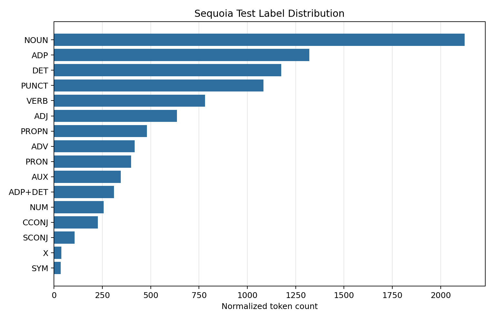
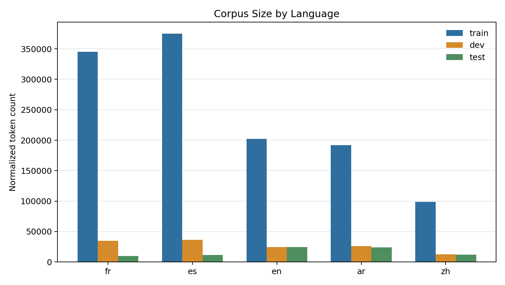
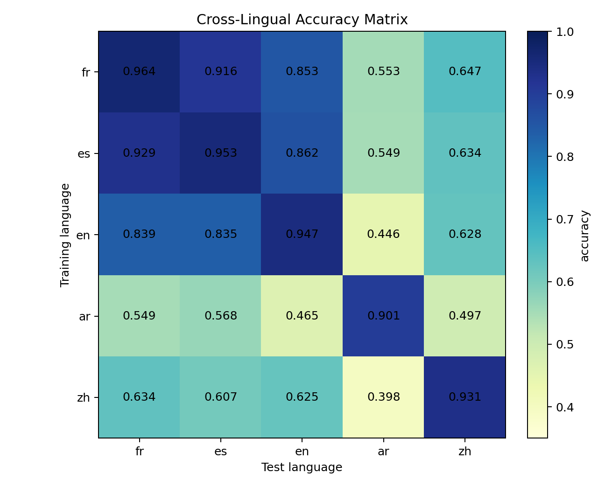

### GitHub: https://github.com/Chu1x/TPLLMs_Lab-5-Multilinguality.git

## Overview and Question Coverage

This lab fine-tunes `bert-base-multilingual-cased` for Universal Dependencies
PoS tagging and evaluates cross-lingual transfer. Instead of the `Trainer` API
itself, the main difficulty is the reconciliation of two tokenization schemes:
UD tokens carry the gold PoS labels, while mBERT predicts over WordPiece
subtokens.

The implementation is in `lab5_multilinguality.py`. The main experiment script
is `scripts/run_lab5_experiments.py`.

The sections below are organized with the style of a report, roughly indicating which lab
questions they answer.


## Warm-up questions on the Universal Dependencies Project (Q1-Q6)

Consistent annotation is necessary because the experiment compares models across
languages. If equivalent syntactic categories were annotated differently from
one treebank to another, cross-lingual differences could reflect annotation
mismatch rather than a real limitation of mBERT.

The provided CoNLL-U loader uses `yield` because a corpus can be read sentence
by sentence without constructing the full list immediately. Calling `list(...)`
then consumes the generator and stores all `(tokens, tags)` pairs for later
analysis or dataset construction.

For the French Sequoia test set, I found 456 sentences and 9734 normalized
tokens. The PoS distribution is very imbalanced:

| Label | Count |
|---|---:|
| NOUN | 2125 |
| ADP | 1320 |
| DET | 1176 |
| PUNCT | 1084 |
| VERB | 781 |
| ADJ | 636 |
| PROPN | 480 |
| ADV | 417 |
| PRON | 398 |
| AUX | 345 |
| ADP+DET | 310 |
| NUM | 257 |
| CCONJ | 227 |
| SCONJ | 106 |
| X | 38 |
| SYM | 34 |

\newpage
The plot is saved as:

{width=60%}

The distribution shows that common categories such as `NOUN`, `ADP`, `DET`,
and `PUNCT` dominate the corpus, while `X` and `SYM` are rare. This means raw
accuracy can hide poor performance on rare categories.

The Sequoia test set contains 310 multiword tokens. Examples include:

| Surface form | Syntactic words | Labels |
|---|---|---|
| des | de les | ADP+DET |
| du | de le | ADP+DET |
| Aux | A les | ADP+DET |
| au | a le | ADP+DET |

UD splits multiword tokens because syntactic annotation is defined over
syntactic words, not necessarily over orthographic surface tokens. This makes
PoS and dependency annotation more comparable across languages. For this lab,
however, I keep the surface token and concatenate the child labels, for example
`ADP+DET`. I agree with the UD decision for annotation consistency, although
for mBERT input I keep surface multiword tokens to preserve the model-facing
text.

UD also permits token forms containing spaces. In Sequoia, I found 13 such
tokens, mostly numbers such as `500 000`, `800 000`, and `80 000`. These spaces
are removed before mBERT tokenization because the tokenizer receives a list of
already-tokenized words.

The Sequoia statistics above answer the warm-up questions only. The
cross-lingual experiment below uses `UD_French-GSD` for French, so its
sentence/token counts differ from Sequoia; this is expected, not a contradiction.

## mBERT Tokenization (Q7-Q9)

mBERT uses subword tokenization to reduce the number of unknown words and to
share vocabulary across many languages. Rare or morphologically complex words
can be represented as sequences of smaller WordPiece units instead of being
mapped directly to `[UNK]`.

For the sentence:

> Pouvez-vous donner les mêmes garanties au sein de l’Union Européenne

UD syntactic-word tokenization works at the level of syntactic words. For this
sentence, the UD-style token list is:

```text
Pouvez -vous donner les mêmes garanties à le sein de l’ Union Européenne
```

Here `Pouvez-vous` is split into the verb and clitic pronoun, `au` corresponds
to `à le`, and `l’Union` is split at the elided determiner. However, in my normalised
model input, UD multiword tokens are kept as surface tokens, so that `au`
remains `au` and receives the merged label `ADP+DET`. With
`bert-base-multilingual-cased`, mBERT then tokenizes the surface input as:

```text
Po ##uve ##z - vous donner les mêmes gara ##nties au sein de l [UNK] Union Euro ##pée ##nne
```

The spelling is `Européenne` throughout. The difference matters because gold
PoS labels are attached to UD tokens, while the model predicts one label per
mBERT input token. Without an alignment rule, the label sequence and model
output sequence would have different lengths.

## Token/Label Alignment and Dataset Construction (Q10-Q16)

The code implements the following alignment rules:

1. UD multiword tokens are kept as surface tokens, and their child labels are
   concatenated, for example `ADP+DET`.
2. If mBERT splits one UD token into several WordPiece units, only the first
   subtoken receives the original label.
3. Special tokens, padding tokens, and continuation subtokens receive the label
   ID `-100`, so PyTorch loss and evaluation ignore them.

The relevant functions are:

- `normalize_ud_sentence`, which keeps multiword surface tokens and concatenates
  their child UPOS labels.
- `tokenize_and_align_labels`, which aligns normalized UD labels to mBERT
  subtokens.
- `build_label_maps`, which encodes string labels as integer IDs.
- `build_dataset_from_conllu`, which creates HuggingFace datasets from CoNLL-U
  files.
- `compute_accuracy_from_logits`, which masks ignored positions during
  evaluation.

The resulting HuggingFace `Dataset` contains the keys expected by mBERT:
`input_ids`, `attention_mask`, and `labels`. The script uses
`Dataset.from_list` to build one dataset for each train, dev, and test split.

All cross-lingual runs use one global `label2id` / `id2label` mapping. The
label vocabulary is the label schema observed in the selected corpora and is
used only to keep label IDs consistent across languages. It is not used to tune
predictions or select results. I checked whether train/dev labels alone cover
test labels; two rare composite labels appear only in test, so the full observed
schema is kept to avoid unknown label IDs during evaluation.

Core implementation sketch:

```python
def normalize_ud_sentence(sentence):
    for token in sentence:
        if token is multiword range:
            words.append(surface_form_without_spaces)
            labels.append("+".join(child_upos_labels))
            skip_child_tokens()
        elif token is not empty_node:
            words.append(form_without_spaces)
            labels.append(upos)

def tokenize_and_align_labels(words, labels):
    encoded = tokenizer(words, is_split_into_words=True,
                        return_offsets_mapping=True,
                        padding=True, truncation=True,
                        max_length=256)
    for start, end in encoded.offset_mapping:
        if (start, end) == (0, 0): label = -100      # special/pad
        elif start == 0: label = label2id[next_label] # first subtoken
        else: label = -100                            # continuation

def compute_metrics(logits, labels):
    pred = argmax(logits)
    mask = labels != -100
    return accuracy(pred[mask], labels[mask])
```

With `truncation=True`, mBERT silently drops tokens beyond the maximum sequence
length. The controlled experiment uses `max_length=256`, so truncation must be
reported at that limit:

| Language | Split | Truncated / Sentences | Rate | Longest tokenized length |
|---|---|---:|---:|---:|
| fr | train | 1 / 14450 | 0.0069% | 562 |
| fr | dev | 0 / 1476 | 0% | 147 |
| fr | test | 0 / 416 | 0% | 122 |
| es | train | 0 / 14186 | 0% | 204 |
| es | dev | 0 / 1400 | 0% | 175 |
| es | test | 0 / 427 | 0% | 157 |
| en | train | 0 / 12544 | 0% | 190 |
| en | dev | 0 / 2001 | 0% | 98 |
| en | test | 1 / 2077 | 0.0481% | 334 |
| ar | train | 32 / 6075 | 0.5267% | 654 |
| ar | dev | 0 / 909 | 0% | 202 |
| ar | test | 12 / 680 | 1.7647% | 467 |
| zh | train | 0 / 3997 | 0% | 168 |
| zh | dev | 0 / 500 | 0% | 134 |
| zh | test | 0 / 500 | 0% | 155 |

At `max_length=256`, truncation is still rare for most languages, but Arabic
test data has the highest truncation rate. This can slightly bias Arabic
evaluation toward shorter examples and should be considered when interpreting
Arabic as the hardest target.

## Language Choice and Pires et al. Comparison (Q17)

I chose five UD treebanks:

| Code | Treebank | Motivation |
|---|---|---|
| fr | UD_French-GSD | Romance language, Latin script |
| es | UD_Spanish-GSD | Romance language close to French |
| en | UD_English-EWT | Germanic language, Latin script |
| ar | UD_Arabic-PADT | Semitic language, Arabic script, richer morphology |
| zh | UD_Chinese-GSD | Sino-Tibetan language, Han script, no whitespace word segmentation |

This selection allows comparison between close transfer, such as French to
Spanish, and more distant transfer across family, script, and morphology.

Pires et al. (2019) evaluated mBERT on many languages. For NER, they used
CoNLL data for Dutch, Spanish, English, and German, plus an internal 16-language
dataset including Arabic, Bengali, Czech, German, English, Spanish, French,
Hindi, Indonesian, Italian, Japanese, Korean, Portuguese, Russian, Turkish, and
Chinese. For POS tagging, they used UD data for 41 languages: Arabic,
Bulgarian, Catalan, Czech, Danish, German, Greek, English, Spanish, Estonian,
Basque, Persian, Finnish, French, Galician, Hebrew, Hindi, Croatian, Hungarian,
Indonesian, Italian, Japanese, Korean, Latvian, Marathi, Dutch, Norwegian
Bokmaal and Nynorsk, Polish, European and Brazilian Portuguese, Romanian,
Russian, Slovak, Slovenian, Swedish, Tamil, Telugu, Turkish, Urdu, and Chinese.

This is broad coverage, but not a controlled linguistic sample. Family, script,
morphology, corpus size, domain, pretraining resource availability, and
annotation quality vary simultaneously, which makes it hard to isolate the
source of cross-lingual transfer. Strong transfer may therefore reflect
relatedness, shared script, lexical overlap, similar word order, or larger
training data rather than multilinguality alone.

## Corpus Size as a Confound (Q18)

| Language | Split | Sentences | Tokens |
|---|---|---:|---:|
| fr | train | 14450 | 344961 |
| fr | dev | 1476 | 34664 |
| fr | test | 416 | 9738 |
| es | train | 14186 | 375031 |
| es | dev | 1400 | 36461 |
| es | test | 427 | 11733 |
| en | train | 12544 | 201963 |
| en | dev | 2001 | 24788 |
| en | test | 2077 | 24740 |
| ar | train | 6075 | 191871 |
| ar | dev | 909 | 25987 |
| ar | test | 680 | 24201 |
| zh | train | 3997 | 98614 |
| zh | dev | 500 | 12665 |
| zh | test | 500 | 12010 |

{width=60%}

The training corpora differ substantially in size. French and Spanish have many
more training tokens than Chinese, while Arabic has fewer sentences but long,
token-dense examples. Corpus size can therefore confound conclusions about
multilinguality that better results may reflect more supervised examples rather
than better cross-lingual representations.

## Training Setup and Metrics (Q14-Q16, Q20)

All models use `bert-base-multilingual-cased` with a token-classification head.
The script reports PoS accuracy during training via `compute_accuracy_from_logits`.
This is important because loss alone is not easy to interpret as tagging
quality, and the metric must ignore all `-100` positions.

Controlled experiment configuration:

| Setting | Value |
|---|---|
| Checkpoint | `bert-base-multilingual-cased` |
| Initialization | Every model starts from the same mBERT checkpoint |
| Languages | `fr`, `es`, `en`, `ar`, `zh` |
| Train/dev/test caps | 1000 / 300 / 300 sentences |
| `max_length` | 256 |
| Epochs | 2 |
| Batch size | 4 |
| Learning rate | `2e-5` |
| Weight decay | 0.01 |
| Random seed | 42 |
| Metric | token accuracy, excluding `-100` labels |
| Label map | one global 138-label vocabulary shared by all models |

The `max_length = 256` setting reduces memory pressure but increases truncation
relative to the default 512-token limit. Arabic was trained on CPU because
pilot runs showed memory pressure on Apple MPS. All other settings are shared.

## Cross-Lingual Experiment Results (Q19)

The full-corpus experiment can be launched with `make full`. Since that is slow
on a laptop, I used the controlled setting:

```bash
make controlled
```

This caps all languages to 1000 train, 300 dev, and 300 test sentences, uses
`max_length = 256`, and trains for 2 epochs. This is not identical to training
on the full corpora, but it controls corpus size more directly and is more
practical on a laptop.

The controlled matrix is saved to:

```text
outputs/lab5_controlled/cross_lingual_accuracy_matrix.csv
```

Pilot run, using only 200 training sentences, 100 dev sentences, 100 test
sentences, and 1 epoch:

| Train \ Test | fr | es | en | ar | zh |
|---|---:|---:|---:|---:|---:|
| fr | 0.265 | 0.192 | 0.154 | 0.343 | 0.280 |
| es | 0.261 | 0.319 | 0.212 | 0.342 | 0.280 |
| en | 0.206 | 0.254 | 0.180 | 0.375 | 0.347 |
| ar | 0.004 | 0.006 | 0.012 | 0.010 | 0.017 |
| zh | 0.184 | 0.195 | 0.167 | 0.332 | 0.314 |

This pilot matrix is only a technical check. The models are undertrained, the
sample sizes are tiny, and the Arabic row is affected by the MPS memory issue.
It should not be used for the final linguistic conclusions.

Controlled 5 x 5 matrix:

| Train \ Test | fr | es | en | ar | zh |
|---|---:|---:|---:|---:|---:|
| fr | 0.964 | 0.916 | 0.853 | 0.553 | 0.647 |
| es | 0.929 | 0.953 | 0.862 | 0.549 | 0.634 |
| en | 0.839 | 0.835 | 0.947 | 0.446 | 0.628 |
| ar | 0.549 | 0.568 | 0.465 | 0.901 | 0.497 |
| zh | 0.634 | 0.607 | 0.625 | 0.398 | 0.931 |

{width=60%}

The mean in-language accuracy is 0.939, while the mean cross-lingual accuracy
is 0.652. Best transfer directions are `es -> fr` at 0.929, `fr -> es` at
0.916, and `en -> fr` at 0.839. These are all between Latin-script European
languages. The strongest in-language versus best-transfer gaps are for Arabic
and Chinese. Arabic drops from 0.901 in-language to 0.568 best transfer
(`ar -> es`), and Chinese drops from 0.931 to 0.634 (`zh -> fr`).

Arabic is the hardest target. Averaging only cross-lingual scores by test
language gives: `fr` 0.738, `es` 0.732, `en` 0.701, `zh` 0.602, and `ar`
0.486. French and Spanish transfer very well to each other, consistent with
shared Romance family membership and Latin script. The Chinese row is
asymmetric: training on Chinese transfers moderately to French, Spanish, and
English, but those languages transfer less well to Chinese than to each other.

## Hyperparameter Fairness and Transfer Analysis (Q20-Q21)

Using the same hyperparameters makes the comparison more controlled, but it is
not automatically fair. Different languages have different corpus sizes,
sentence lengths, morphology, and tokenization behavior. A fair protocol should
fix the main hyperparameters in advance, use comparable training budgets, and
only tune on development data.

Transfer is strongest between languages that share script, family, and
morphosyntactic properties, especially French and Spanish. Transfer is weaker
when script, morphology, and tokenization differ, especially when Arabic is the
target language. The Chinese row is asymmetric: training on Chinese transfers
moderately to French, Spanish, and English, but those languages transfer less
well to Chinese than they do to each other. The matrix should therefore be
interpreted against typological distance, script, segmentation, and corpus
properties rather than as a single scalar measure of multilinguality.

## References

- Pires, Telmo, Eva Schlinger, and Dan Garrette. 2019. *How multilingual is
  Multilingual BERT?* ACL. https://aclanthology.org/P19-1493/
- Google Research publication page:
  https://research.google/pubs/how-multilingual-is-multilingual-bert/
